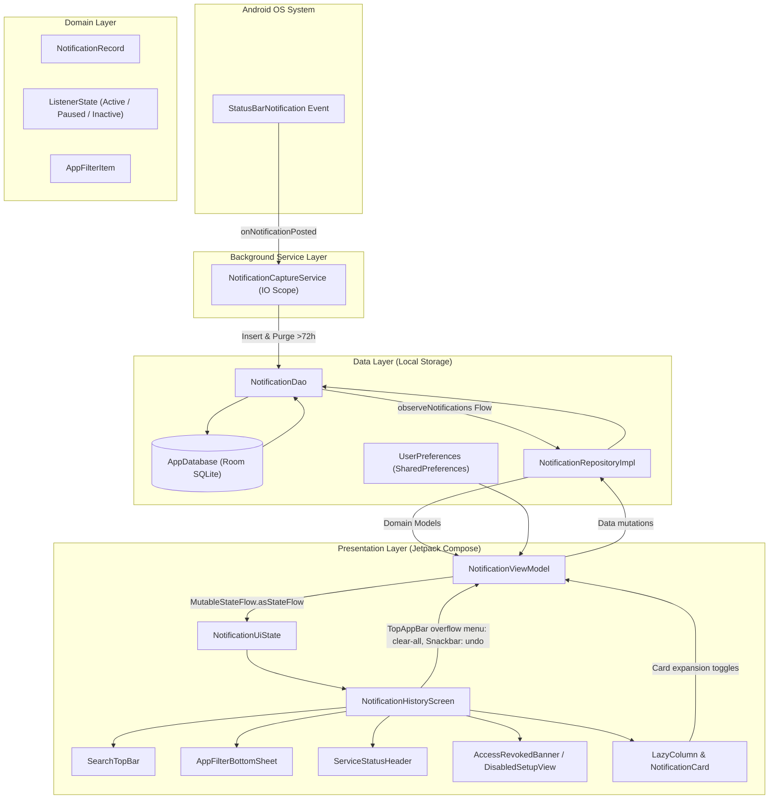

# Recall (Android)

[](file:///Users/fblazt/Code/Personal/andro/notification-history/app/build.gradle.kts)
[](file:///Users/fblazt/Code/Personal/andro/notification-history/app/build.gradle.kts)
[](file:///Users/fblazt/Code/Personal/andro/notification-history/gradle/libs.versions.toml)
[](file:///Users/fblazt/Code/Personal/andro/notification-history/app/build.gradle.kts)
[](file:///Users/fblazt/Code/Personal/andro/notification-history/app/src/main/AndroidManifest.xml)
[](file:///Users/fblazt/Code/Personal/andro/notification-history/app/src/main/AndroidManifest.xml)

A native, offline-first Android application that captures and stores status bar notifications locally in an SQLite database with an automatic 72-hour rolling retention policy, displayed in an expressive Material You dark theme feed.

---

## Key Features

- **Status Bar Notification Capture**: Continuous background interception powered by [`NotificationCaptureService`](file:///Users/fblazt/Code/Personal/andro/notification-history/app/src/main/java/com/notificationhistory/service/NotificationCaptureService.kt) (`NotificationListenerService`). Automatically skips internal self-notifications and system noise.
- **Real-Time Keyword Search & Application Filtering**: Instant keyword search triggered via top-bar magnifier icon, active app filter chips, dynamic match count summaries, and complete per-application filtering via a Material 3 modal bottom sheet.
- **Visual Substring Match Highlighting**: Real-time visual highlighting of search queries via styled inline substring spans within notification titles and message bodies, with match count badges and summaries provided in the filter controls.
- **Reactive Permission States & Summary**: Service state is surfaced by [`DisabledSetupView`](file:///Users/fblazt/Code/Personal/andro/notification-history/app/src/main/java/com/notificationhistory/ui/components/DisabledSetupView.kt) (initial onboarding) and [`AccessRevokedBanner`](file:///Users/fblazt/Code/Personal/andro/notification-history/app/src/main/java/com/notificationhistory/ui/components/AccessRevokedBanner.kt) (paused state) when system notification access is revoked or restricted, alongside a captured notification counter and rolling 3-day window summary row in [`ServiceStatusHeader`](file:///Users/fblazt/Code/Personal/andro/notification-history/app/src/main/java/com/notificationhistory/ui/components/ServiceStatusHeader.kt) ("$capturedCount notifications • Last 3 days").
- **100% Offline Privacy**: Zero network permissions declared in [`AndroidManifest.xml`](file:///Users/fblazt/Code/Personal/andro/notification-history/app/src/main/AndroidManifest.xml). Notification content never leaves the device.
- **72-Hour Rolling Retention**: Automated pruning of expired records executed on every incoming notification and on-demand repository triggers to keep SQLite storage lightweight.

---

## Architecture & Tech Stack

### Clean Architecture & Unidirectional Data Flow

The project follows Clean Architecture principles with unidirectional data flow (UDF) through Kotlin `StateFlow` and Coroutines:



### Layer Breakdown

- **Service Layer (`service/`)**:
  - [`NotificationCaptureService`](file:///Users/fblazt/Code/Personal/andro/notification-history/app/src/main/java/com/notificationhistory/service/NotificationCaptureService.kt): Extends Android's `NotificationListenerService`. Dispatches asynchronous processing to a dedicated `SupervisorJob` + `Dispatchers.IO` coroutine scope, resolves app labels, inserts entities, and purges records older than 72 hours.
- **Data Layer (`data/`)**:
  - [`AppDatabase`](file:///Users/fblazt/Code/Personal/andro/notification-history/app/src/main/java/com/notificationhistory/data/local/AppDatabase.kt): Room SQLite database instance managing local storage.
  - [`NotificationDao`](file:///Users/fblazt/Code/Personal/andro/notification-history/app/src/main/java/com/notificationhistory/data/local/NotificationDao.kt): Reactive Room queries returning `Flow<List<NotificationEntity>>`, batch operations, and timestamp-based eviction queries.
  - [`NotificationEntity`](file:///Users/fblazt/Code/Personal/andro/notification-history/app/src/main/java/com/notificationhistory/data/local/NotificationEntity.kt): Local SQLite schema representation with indexed columns.
  - [`NotificationRepository`](file:///Users/fblazt/Code/Personal/andro/notification-history/app/src/main/java/com/notificationhistory/data/repository/NotificationRepository.kt) & [`NotificationRepositoryImpl`](file:///Users/fblazt/Code/Personal/andro/notification-history/app/src/main/java/com/notificationhistory/data/repository/NotificationRepositoryImpl.kt): Repository handling dispatcher switching (`Dispatchers.IO`), entity-to-domain transformations, batch clears, and atomic restoration.
  - [`UserPreferences`](file:///Users/fblazt/Code/Personal/andro/notification-history/app/src/main/java/com/notificationhistory/data/local/UserPreferences.kt): Persistent storage tracking onboarding and setup completion.
- **Domain Layer (`domain/`)**:
  - [`NotificationRecord`](file:///Users/fblazt/Code/Personal/andro/notification-history/app/src/main/java/com/notificationhistory/domain/model/NotificationRecord.kt): Immutable domain model holding title, content, app name, package name, timestamps, and UI expansion state.
  - [`ListenerState`](file:///Users/fblazt/Code/Personal/andro/notification-history/app/src/main/java/com/notificationhistory/domain/model/ListenerState.kt): Sealed representation of listener status (`Active`, `Paused`, `Inactive`).
  - [`AppFilterItem`](file:///Users/fblazt/Code/Personal/andro/notification-history/app/src/main/java/com/notificationhistory/domain/model/AppFilterItem.kt): Encapsulates application filter properties, total counts, query match counts, and selection states.
- **UI Layer (`ui/`)**:
  - [`MainActivity`](file:///Users/fblazt/Code/Personal/andro/notification-history/app/src/main/java/com/notificationhistory/MainActivity.kt): Single-activity entry point hosting edge-to-edge Compose UI.
  - [`NotificationHistoryScreen`](file:///Users/fblazt/Code/Personal/andro/notification-history/app/src/main/java/com/notificationhistory/ui/NotificationHistoryScreen.kt): Container composable coordinating top app bar, service status banner, list state, and snackbars.
  - [`NotificationViewModel`](file:///Users/fblazt/Code/Personal/andro/notification-history/app/src/main/java/com/notificationhistory/ui/NotificationViewModel.kt): ViewModel orchestrating UI state, permission checks, card expansion toggles, batch deletion, and undo restoration.
  - [`NotificationUiState`](file:///Users/fblazt/Code/Personal/andro/notification-history/app/src/main/java/com/notificationhistory/ui/NotificationUiState.kt): Single immutable state data class consumed by Compose components.
  - Components:
    - [`SearchTopBar`](file:///Users/fblazt/Code/Personal/andro/notification-history/app/src/main/java/com/notificationhistory/ui/components/SearchTopBar.kt): Dedicated pill-shaped search bar with query clear action, back navigation, and filter trigger.
    - [`AppFilterBottomSheet`](file:///Users/fblazt/Code/Personal/andro/notification-history/app/src/main/java/com/notificationhistory/ui/components/AppFilterBottomSheet.kt): Material 3 modal bottom sheet supporting nested app search, radio selection, and dynamic match counts.
    - [`NotificationCard`](file:///Users/fblazt/Code/Personal/andro/notification-history/app/src/main/java/com/notificationhistory/ui/components/NotificationCard.kt): Expandable notification list item card.
    - [`NotificationMetadataSection`](file:///Users/fblazt/Code/Personal/andro/notification-history/app/src/main/java/com/notificationhistory/ui/components/NotificationMetadataSection.kt): Drawer showing raw system metadata and key attributes.
    - [`ServiceStatusHeader`](file:///Users/fblazt/Code/Personal/andro/notification-history/app/src/main/java/com/notificationhistory/ui/components/ServiceStatusHeader.kt): Displays captured notification counter and rolling 3-day window summary row ("$capturedCount notifications • Last 3 days"). Service state is surfaced by DisabledSetupView (initial onboarding) and AccessRevokedBanner (paused state).
    - [`AccessRevokedBanner`](file:///Users/fblazt/Code/Personal/andro/notification-history/app/src/main/java/com/notificationhistory/ui/components/AccessRevokedBanner.kt): Warning callout when listener permission has been disabled.
    - [`DisabledSetupView`](file:///Users/fblazt/Code/Personal/andro/notification-history/app/src/main/java/com/notificationhistory/ui/components/DisabledSetupView.kt): Initial onboarding screen when permissions are not yet configured.

### Tech Stack Details

| Technology | Specification / Version | Reference |
| :--- | :--- | :--- |
| **Language** | Kotlin 2.3.20 (JVM Toolchain 17) | [`build.gradle.kts`](file:///Users/fblazt/Code/Personal/andro/notification-history/app/build.gradle.kts) |
| **Min / Target SDK** | Min SDK 33 (Android 13 Tiramisu) / Target & Compile SDK 36 | [`build.gradle.kts`](file:///Users/fblazt/Code/Personal/andro/notification-history/app/build.gradle.kts) |
| **UI Framework** | Jetpack Compose BOM `2026.03.01` & Material Design 3 | [`libs.versions.toml`](file:///Users/fblazt/Code/Personal/andro/notification-history/gradle/libs.versions.toml) |
| **Local Database** | AndroidX Room 2.7.2 with Google KSP | [`libs.versions.toml`](file:///Users/fblazt/Code/Personal/andro/notification-history/gradle/libs.versions.toml) |
| **Asynchrony & State** | Kotlinx Coroutines 1.10.2 & `StateFlow` | [`libs.versions.toml`](file:///Users/fblazt/Code/Personal/andro/notification-history/gradle/libs.versions.toml) |
| **Navigation** | AndroidX Navigation3 Core 1.0.1 | [`libs.versions.toml`](file:///Users/fblazt/Code/Personal/andro/notification-history/gradle/libs.versions.toml) |
| **Build Tool** | Android Gradle Plugin 9.0.1 / Gradle 9.1.0 | [`libs.versions.toml`](file:///Users/fblazt/Code/Personal/andro/notification-history/gradle/libs.versions.toml) |

---

## Setup & Permission Instructions

Android requires explicit user authorization via the **Device & app notifications** (Special app access) menu to allow third-party applications to inspect status bar events.

### Enabling Notification Access (Android 13+)

1. Install and launch the application.
2. In the initial [`DisabledSetupView`](file:///Users/fblazt/Code/Personal/andro/notification-history/app/src/main/java/com/notificationhistory/ui/components/DisabledSetupView.kt) screen, tap **"Open settings"**.
3. You will be redirected directly into the system settings page for **Recall**.
4. Toggle **"Allow notification access"** to **ON** and confirm the Android system security prompt.
5. Return to the app. Returning to the app displays the active feed with the notification summary row in [`ServiceStatusHeader`](file:///Users/fblazt/Code/Personal/andro/notification-history/app/src/main/java/com/notificationhistory/ui/components/ServiceStatusHeader.kt) ("X notifications • Last 3 days").

> [!NOTE]
> On sideloaded APKs on Android 13+ (API 33+), Android may mark notification listener permissions as "Restricted settings". If the toggle is greyed out:
> 1. Go to **Settings > Apps > Recall**.
> 2. Tap the **three-dots menu (⋮)** in the top right corner.
> 3. Tap **"Allow restricted settings"** and authenticate with your device PIN or fingerprint.
> 4. Re-open the app and grant notification access.

### Settings Navigation Behavior

The application utilizes [`SettingsNavigationHelper`](file:///Users/fblazt/Code/Personal/andro/notification-history/app/src/main/java/com/notificationhistory/util/SettingsNavigationHelper.kt) for robust navigation across different Android OEM builds:
- **Direct Target (Android 11+ / API 30+)**: Dispatches `Settings.ACTION_NOTIFICATION_LISTENER_DETAIL_SETTINGS` pre-populated with `NotificationCaptureService` component name, jumping straight to this app's toggle page.
- **Graceful Fallback**: If the OEM platform fails to resolve the direct detail intent, it falls back seamlessly to `Settings.ACTION_NOTIFICATION_LISTENER_SETTINGS` (the global listener list).

---

## Developer Commands

Run all commands from the repository root:

```bash
# Compile Kotlin code across debug variants
./gradlew compileDebugKotlin

# Run all 45 JVM unit tests covering Repository, Card formatting, Search/Filter ViewModel logic, and ServiceStatusHeader
./gradlew testDebugUnitTest

# Assemble the debug APK (outputs to app/build/outputs/apk/debug/)
./gradlew assembleDebug

# Clean build cache and artifacts
./gradlew clean
```
